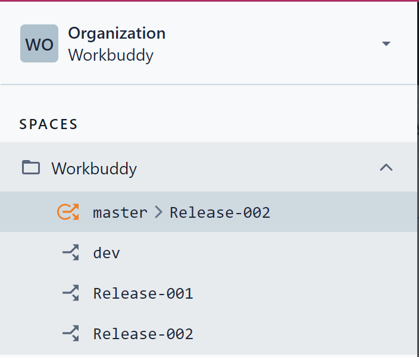
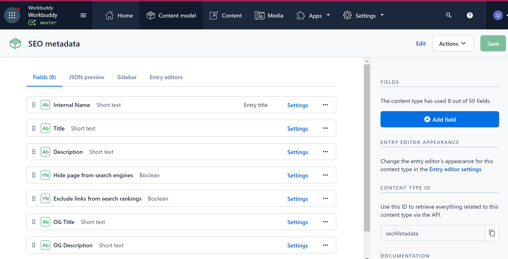
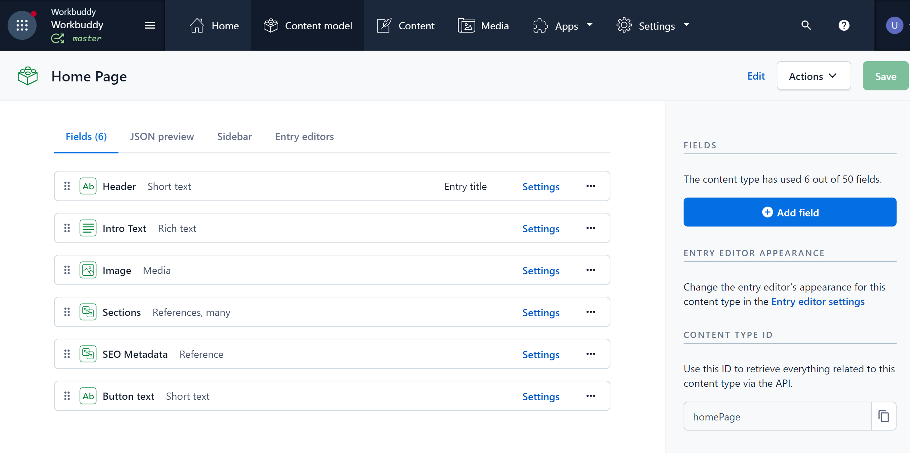
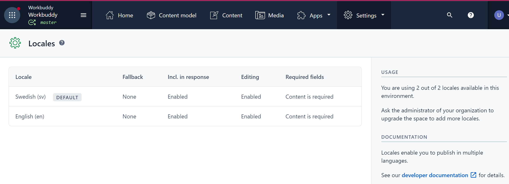
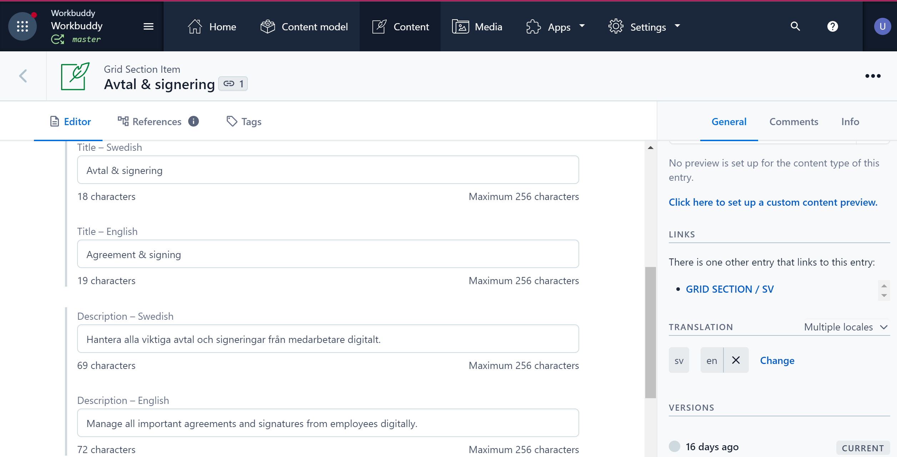

## Internship GetIt Nordic
## Project realized by Carin Wood & Ursula Vallejo.

- [GetItNordic Web Page](https://getitnordic.com/)

- [Web Page of the version Project is launch: www.GetHub.es](https://gethub.se/)

- [Demo with all the implementation : Netufly](https://gethub-demo-projekt.netlify.app/)


## Video-Demo Project:


# Detailed information: 

## Introduction:

In the development of the project, we have used new tools as Next JS, Contentful, GraphQl, Apolo Server, SEO. We will explore in detailed below.

Here is the layout we implemented on the project provided by the Ux designer of the company:

- [WireFrames](https://xd.adobe.com/view/48935ae1-817e-41da-98ee-fc309c57a868-1dc0/screen/b2dc6744-2297-4621-bedf-50e433995c55/specs/)


# Next.Js

* SEO :

  It allows us to provide SEO data information to better position our site in searches.
* 
```javascript
<index.js>
    import Head from "next/head";

    <MyHead
        title={seoMetadata.title}
        description={seoMetadata.description}
        ogTitle={seoMetadata.ogTitle ?? seoMetadata.title}
        ogDescription={seoMetadata.ogDescription ?? seoMetadata.description}
        ogImage={seoMetadata.ogImage}
        hidePage={seoMetadata.hidePage}
        excludeLinks={seoMetadata.excludeLinks}
    />

    <myHead.tsx>
    import Head from "next/head";

    type Props = {
    title: string;
    description?: string;
    ogTitle?: string;
    ogDescription?: string;
    ogImage?: any;
    hidePage?: boolean;
    excludeLinks?: boolean;
};

    export const MyHead = ({
    title,
    description,
    ogTitle,
    ogDescription,
    ogImage,
    hidePage,
    excludeLinks,
}: Props) => {
    return (
    <>
    <Head>
    <title>{`${
    process.env.NEXT_PUBLIC_ENVIRONMENT != "master"
    ? `${process.env.NEXT_PUBLIC_ENVIRONMENT.toUpperCase()} - `
    : ""
}${title}`}</title>
    <meta name="title" content={title} />
    <meta name="description" content={description} />
    <meta property="og:title" content={ogTitle ?? title} />
    <meta
    property="og:description"
    content={ogDescription ?? description}
    />
{ogImage?.url && <meta property="og:image" content={ogImage.url} />}
    <meta
    name="robots"
    content={`${hidePage ? "noindex" : "index"}, ${
    excludeLinks ? "nofollow" : "follow"
}`}
    />
    </Head>
    </>
    );
};

```

* API: 

The API is managed in the same folder in the project.

In Next JS the Backend is managed within the same project, there is no need to generate a client and a server side.

```javascript
import {
  ApolloClient,
  InMemoryCache,
  DefaultOptions,
  createHttpLink,
} from "@apollo/client";
import { setContext } from "@apollo/client/link/context";

const authLink = setContext((_, { headers }) => {
  const token = process.env.NEXT_PUBLIC_CONTENT_DELIVERY_TOKEN;
  return {
    headers: {
      ...headers,
      authorization: `Bearer ${token}`,
    },
  };
});

const httpLink = createHttpLink({
  uri: `https://graphql.contentful.com/content/v1/spaces/${process.env.NEXT_PUBLIC_SPACE_ID}/environments/${process.env.NEXT_PUBLIC_ENVIRONMENT}`,
});

const defaultOptions: DefaultOptions = {
  query: {
    fetchPolicy: "no-cache",
    errorPolicy: "all",
  },
};

const client = new ApolloClient({
  cache: new InMemoryCache(),
  defaultOptions,
  link: authLink.concat(httpLink),
});

export { client };

```

* Router:  

On Next JS the pages generated inside the pages folder generate automatically their router without having to configure them.

There are different types of ways to use the router:

- Routing with Pages
- Nested Routes
- Dynamic Rotes [slug]

In our project we implement the dynamic router for the landing page. Router name is taken from [slug] assigned to it in contentful.
Therefore, it can vary without having to go into programming.

[](./styles/assets/images/next.png)

- [Next Tutorial](https://www.youtube.com/watch?v=9P8mASSREYM&list=PLC3y8-rFHvwgC9mj0qv972IO5DmD-H0ZH&index=2)
- [Next Tutorial Pedro Tech](https://youtu.be/tsmaQdgidKg)
- [Next Tutorial Codevolution](https://youtu.be/9P8mASSREYM)


* Data Fetching from Contentful with GetServerSideProps:

- Render Sections 
```javascript
 <index.tsx>
import type { GetServerSideProps } from "next";
import Head from "next/head";
import styles from "../styles/home.module.scss";
import { client } from "../lib/api/apolloClient";
import { getHomePageQuery } from "../lib/api/pages";
import { HomePageModel } from "../lib/models/homePageModel";
import { getSection } from "../lib/utils/sectionPicker";
import Image from "next/image";
import { documentToReactComponents } from "@contentful/rich-text-react-renderer";
import { MyHead } from "../lib/components/myHead";

type Props = {
  data: HomePageModel;
};

const Home = ({ data }: Props) => {
  const { header, image, introText, buttonText, seoMetadata } = data;

  return (
    <>
   
      <div className={styles.container}>
        <div className={styles.wrapper}>
          <div className={styles.headerContainer}>
            <div className={styles.textDiv}>
              <h1 className={styles.header}>{header}</h1>
              <div className={styles.introText}>
                {introText?.json && documentToReactComponents(introText.json)}
              </div>
              <div className={styles.buttonText}>{buttonText}</div>
            </div>
            <div className={styles.imgContainer}>
              <Image
                src={image.url}
                alt="HeroPhoto"
                width="1181"
                height="1181"
                objectFit="contain"
                loading="eager"
                quality={70}
              />
            </div>
            {/* <div className={styles.button}>{buttonText}</div> */}
          </div>
        </div>
        {/* RENDER SECTIONS */}
        {data.sectionsCollection.items.map((section: any) =>
          getSection(section.__typename, section.sys?.id)
        )}
      </div>
    </>
  );
};

export const getServerSideProps: GetServerSideProps = async ({ locale }) => {
  const { data, error } = await client.query({
    query: getHomePageQuery(),
    variables: {
      locale: locale,
    },
  });

  let home = data.homePageCollection.items[0] ?? {};

  return {
    props: {
      data: home as HomePageModel,
    },
  };
};

export default Home;
```

```javascript
<sectionPicker.tsx>
const sectionsMap = new Map<string, Function>([
["GridSection", (id: string) => <GridSection key={id} id={id} />],
["PricingSection", (id: string) => <PricingSection key={id} id={id} />],
]);

export const getSection = (typename: string, id: string): JSX.Element => {
return sectionsMap.has(typename) ? sectionsMap.get(typename)(id) : null;
};
```
* Locale:  i18next implementation to handle locale attached to contentful.

- [i18next](https://next.i18next.com/)

- [Next.Js](https://nextjs.org/)


# GraphQL

GraphQL is a query language for APIs.

It makes it possible to make more precise API queries by reducing the amount of data imported, making it more efficient and faster.

Contentful has an app that helps generate the GraphQl queries for the project

[](./styles/assets/images/GraphQL.png)

```javascript
import { gql, DocumentNode } from '@apollo/client';

export const getHomePageQuery = (): DocumentNode => {
  return gql`
    query ($locale: String!) {
      homePageCollection(limit: 1, locale: $locale) {
        items {
          header
          introText {
            json
          }
          image {
            url
          }
          seoMetadata {
            title
            description
            ogTitle
            ogDescription
            ogImage {
              url
            }
            hidePage
            excludeLinks
          }
          buttonText
          sectionsCollection {
            items {
              __typename
              sys {
                id
              }
            }
          }
        }
      }
    }
  `;
};
```

- [Graphql](https://graphql.org/)
- [Tutorial Laith Academy](https://youtu.be/gAbIQx26wSI)

# Contentful

Contentful is a headless content management system.

Contentful is the platform where you can update the content of your website, a mobile app or any other platform that displays content.

Contentful give the option to handle locale; that way is possible to have the page in different language in our case Swedish and English.

```javascript
<env.local>
    NEXT_PUBLIC_ENVIRONMENT=dev
    
    NEXT_PUBLIC_SPACE_ID=
    NEXT_PUBLIC_CONTENT_DELIVERY_TOKEN=

```

[](./styles/assets/images/contenful1.png)

[](./styles/assets/images/model.png)

[](./styles/assets/images/model2.png)

[](./styles/assets/images/locales.png)

[](./styles/assets/images/content.png)


- [Contentful](https://www.contentful.com/)
- [Tutorial React /Contentful](https://youtube.com/playlist?list=PL4cUxeGkcC9jClk8wl1yJcN3Zlrr8YSA1)

# SASS

Sass stands for Syntactically Awesome Stylesheet. Sass is an extension to CSS. Sass is a CSS pre-processor. Sass is fully compatible with all versions of CSS.
Sass reduces repetition of CSS and therefore saves time.


[](./styles/assets/images/SASS1.webp)

```javascript

<SASS Css moduler>

    @import "../../../../styles/breakpoints.scss";
    
.headerContainer {
  margin-bottom: 2em;
  h4 {
    margin-bottom: 0.5em;
    font-size: 22px;
    font-family: "Poppins-Bold";
    font-weight: 100;
  }

  h2 {
    font-size: 30px;
    @include respond-to("s") {
      font-size: 42px;
    }
    @include respond-to("m") {
      font-size: 46px;
    }
    @include respond-to("l") {
      font-size: 50px;
    }
  }
}

<SASS Breakpoints.scss>

    $breakpoints: (
    "s": 768px,
    "m": 1024px,
    "l": 1336px,
    "xl": 1639px,
    ) !default;

    @mixin respond-to($breakpoint) {
@if map-has-key($breakpoints, $breakpoint) {
    @media (min-width: map-get($breakpoints, $breakpoint)) {
    @content;
}
} @else {
    @warn "Unfortunately, no value could be retrieved from `#{$breakpoint}`. "
    + "Available breakpoints are: #{map-keys($breakpoints)}.";
}
}


```
- [SASS](https://sass-lang.com/)

# Sendgrid

SendGrid is a cloud-based SMTP provider that allows you to send email without having to maintain email servers.

SendGrid handles all the technical details, from infrastructure scaling to ISP outreach and reputation monitoring to whitelist services and real-time analytics.

```javascript
<pages / sendgrid.js>

    import sendgrid from "@sendgrid/mail";

    async function sendEmail(req, res) {
    try {
    sendgrid.setApiKey(process.env.NEXT_PUBLIC_SENDGRID_API_KEY);
    await sendgrid.send({
    to: "Your email where you'll receive emails",
    from: "your website email address here ",
    subject: `GetHub EOI from salesite`,
    html: `<h1>EOI från Gethub.se</h1>
              <p><strong>Namn:</strong> ${req.body.fullName}</p>
              <p><strong>Företag:</strong> ${req.body.company}</p>
              <p><strong>Email:</strong> ${req.body.email}</p>
`,
});
} catch (error) {
    console.log(error.message);
    return res.status(error.statusCode || 500).json({ error: error.message });
}

    return res.status(200).json({ error: "" });
}

    export default sendEmail;

```

```javascript
<contact.tsx>

    export const ContactSection = ({ id }: Props) => {
    const { locale } = useRouter();

    const { loading, data } = useQuery(getContactSectionQuery(id), {
    variables: {
    locale: locale,
},
});

    const [fullName, setFullName] = useState("");
    const [company, setCompany] = useState("");
    const [email, setEmail] = useState("");

    //   Form validation state

    const [errors, setErrors] = useState<any>({});

    // Setting success or failure messages states

    const [showSuccessMessage, setShowSuccessMessage] = useState(false);
    const [showFailureMessage, setShowFailureMessage] = useState(false);

    if (loading) return <div></div>;
    // Validation check method

    const handleValidation = () => {
    let tempErrors: any = {};
    let isValid = true;

    if (fullName.length <= 0) {
    tempErrors["fullName"] = true;
    isValid = false;
}
    if (email.length <= 0) {
    tempErrors["email"] = true;
    isValid = false;
}
    if (company.length <= 0) {
    tempErrors["company"] = true;
    isValid = false;
}

    setErrors({ ...tempErrors });
    return isValid;
};

    //   Handling form submit

    const handleSubmit = async (e: any) => {
    e.preventDefault();

    let isValidForm = handleValidation();

    if (isValidForm) {
    const res = await fetch("/api/sendgrid", {
    body: JSON.stringify({
    email: email,
    fullName: fullName,
    company: company,
}),
    headers: {
    "Content-Type": "application/json",
},
    method: "POST",
});

    const { error } = await res.json();
    if (error) {
    setShowSuccessMessage(false);
    setShowFailureMessage(true);

    return;
}

    setShowSuccessMessage(true);
    setShowFailureMessage(false);
    // Reset form fields
    setFullName("");
    setEmail("");
    setCompany("");
}
};
```

- [SENDGrid](https://sendgrid.com/)

- [SENDGrid Implementation Tutorial](https://www.freecodecamp.org/news/how-to-build-a-working-contact-form-with-sendgrid-and-next-js/)


# Azure Dev app

[](./styles/assets/images/azureDev.png)

https://triptale.net/functions/